# Gandi DNS WebUI

[](https://github.com/galti3r/gandi-pat-webui/actions/workflows/ci.yml)
[](https://planned-merlina-alexandre-galtier-5097d63d.koyeb.app)
[](LICENSE)

> **Live demo:** [planned-merlina-alexandre-galtier-5097d63d.koyeb.app](https://planned-merlina-alexandre-galtier-5097d63d.koyeb.app) — try it with your own Gandi PAT, nothing is stored server-side.

A fast, single-purpose web interface for managing DNS records via the [Gandi LiveDNS API](https://api.gandi.net/docs/livedns/). Zero dependencies, vanilla JavaScript, dark mode, works in any modern browser.

## Why?

Gandi's admin panel requires multiple clicks to view and edit DNS records. This tool gives you a single-page interface focused on DNS management: instant search, type filtering, bulk view, keyboard shortcuts, and client-side validation before every API call.

## Architecture

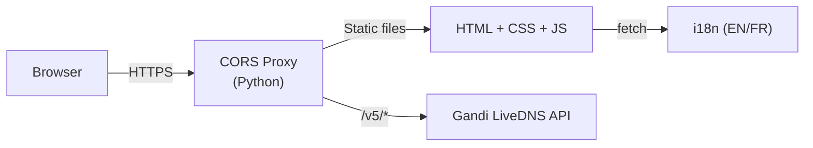

> The Gandi API does not support CORS, so a lightweight reverse proxy is required. The proxy only forwards `/v5/*` requests -- it never stores or logs your token.

## Get a Personal Access Token

1. Go to [Gandi Admin > Personal Access Tokens](https://admin.gandi.net/organizations/account/pat)
2. Create a token with **"Manage domain technical configurations"** permission
3. Copy the token (shown only once)

## Quick Start

### Docker / Podman

```bash
docker run -p 8000:8000 ghcr.io/galti3r/gandi-pat-webui:latest
# or
podman run -p 8000:8000 ghcr.io/galti3r/gandi-pat-webui:latest
```

Open http://localhost:8000 and enter your PAT.

### Vercel

[](https://vercel.com/new/clone?repository-url=https://github.com/galti3r/gandi-pat-webui)

### Local Development

```bash
git clone https://github.com/galti3r/gandi-pat-webui.git
cd gandi-pat-webui
make serve    # Build + serve on http://localhost:8000
```

Requires: `make`, `bash`, `python3`, `node >= 18` (for tests only).

## Features

- Full CRUD for 25 DNS record types (A, AAAA, CNAME, MX, TXT, SRV, CAA...)
- Three-tier validation: dedicated forms (Tier 1), guided textarea (Tier 2), raw (Tier 3)
- Cross-record checks: CNAME exclusivity, circular chains, SPF uniqueness
- Record cloning (duplicate existing records)
- Local change history with diff viewer and rollback (IndexedDB)
- Auto-refresh (30s / 1m / 5m)
- Bulk operations (multi-select, batch delete, batch TTL)
- DNSSEC key viewer
- Nameserver viewer and editor with safety warnings
- Dark / light theme with system preference detection
- Responsive: sidebar, tablet rail, mobile tabs
- Keyboard shortcuts (`?` for help)
- Undo record deletion (5s grace period)
- Available in English and French (auto-detected)
- Only domains accessible to the provided token are displayed

## Screenshots

### Desktop

| View | |
|------|---|
| Authentication | 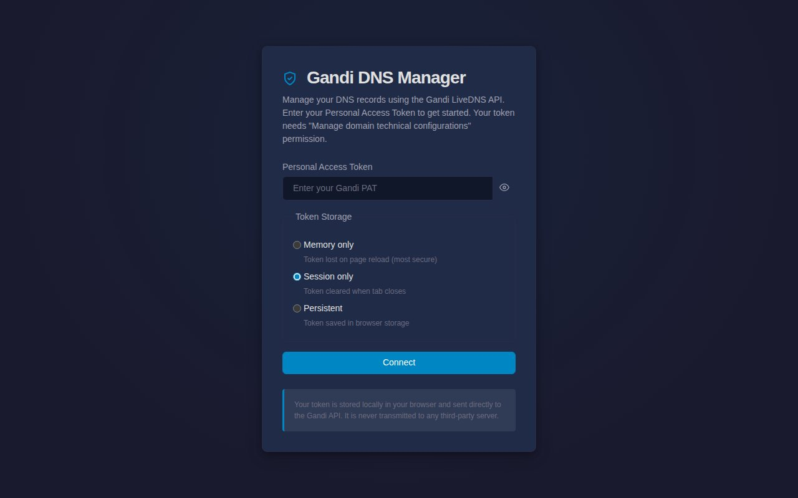 |
| Records (dark mode) | 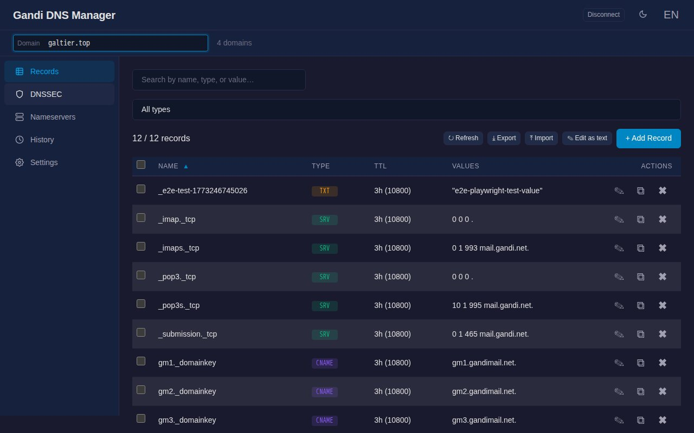 |
| Records (light mode) | 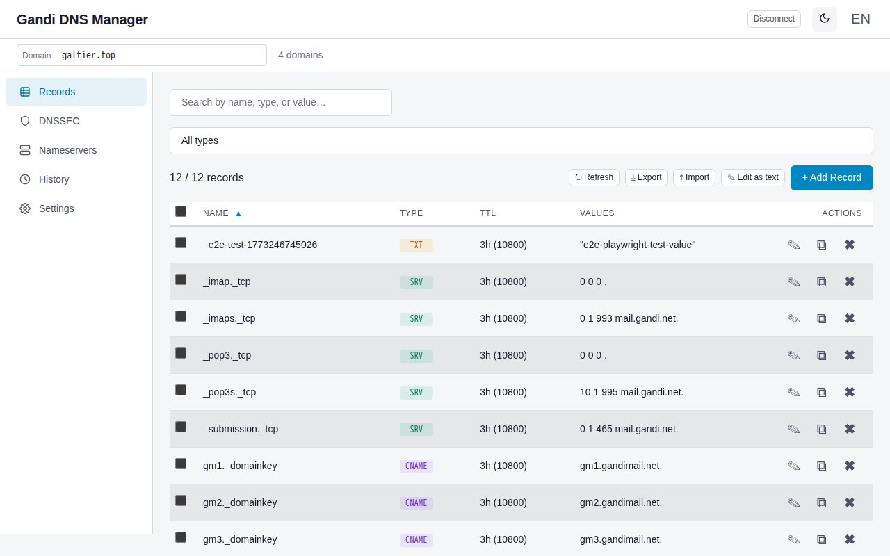 |
| Record form | 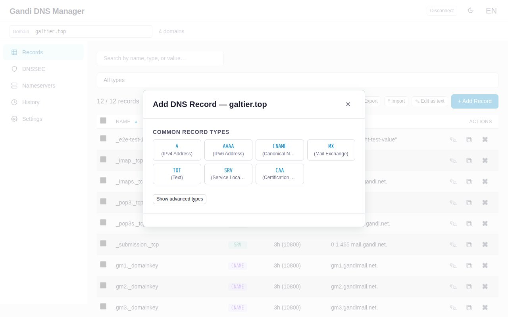 |
| DNSSEC | 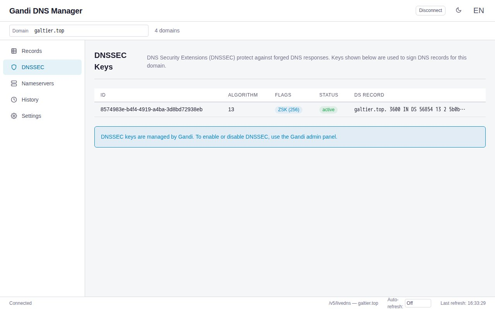 |
| Nameservers | 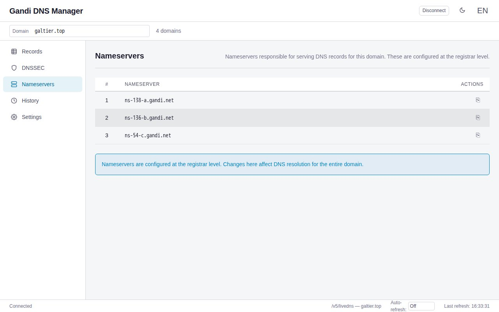 |
| History | 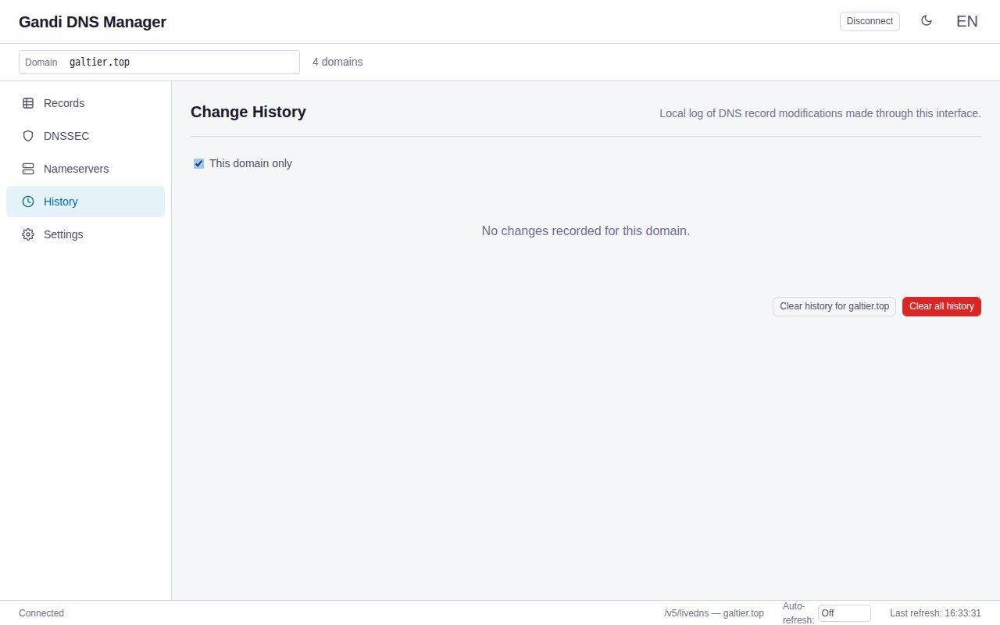 |

### Mobile

| View | |
|------|---|
| Records | 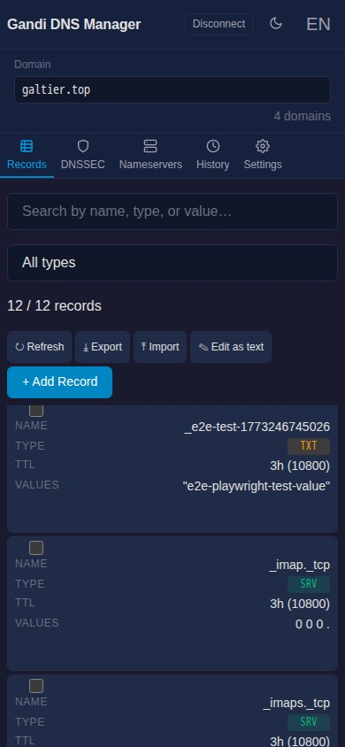 |
| Records (scrolled) | 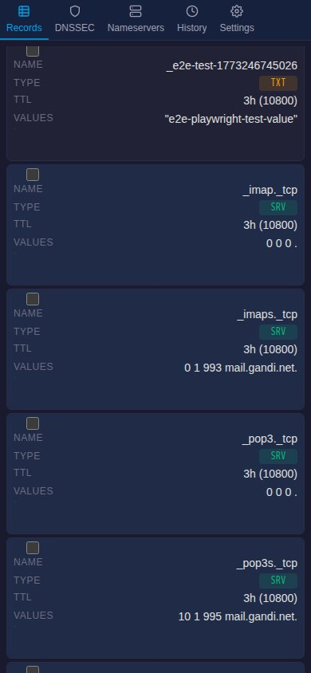 |
| Nameservers | 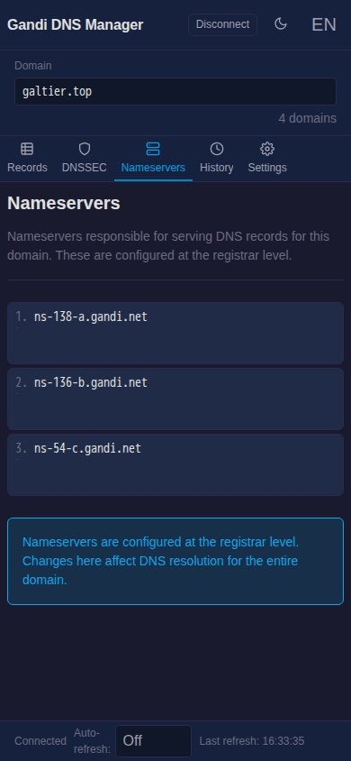 |

## Browser Support

| Browser | Minimum Version |
|---------|----------------|
| Chrome  | 105+           |
| Firefox | 110+           |
| Safari  | 16.4+          |
| Edge    | 105+           |

## Deployment

| Method | How | Notes |
|--------|-----|-------|
| **Docker / Podman** | `docker run -p 8000:8000 ghcr.io/galti3r/gandi-pat-webui` | Self-hosted, Python CORS proxy |
| **Vercel** | One-click deploy or `vercel --prod` | Edge Function proxy, zero infra |
| **Koyeb (Docker)** | [](https://app.koyeb.com/deploy?type=docker&image=ghcr.io/galti3r/gandi-pat-webui&name=gandi-dns-webui&ports=8000;http;/) | Managed container, port 8000 |
| **Koyeb (Git)** | Deploy from GitHub repo | Python buildpack, auto-detected |

### Docker Compose / Podman Compose

```bash
# Start the web server (build + serve)
docker compose up --build
# or
podman-compose up --build
```

This starts the CORS proxy on http://localhost:8000. See `docker-compose.yml` for the full configuration (includes an optional E2E test service).

To run E2E tests in containers:

```bash
make e2e   # auto-detects podman-compose or docker compose
```

### Koyeb (Git / Buildpacks)

Deploy directly from your GitHub repository — no Docker image needed:

1. Create a new Koyeb app, select **GitHub** as source
2. Point to your repository and branch (`main`)
3. Koyeb auto-detects the Python buildpack via `requirements.txt` and `runtime.txt`
4. The `Procfile` and `bin/post_compile` handle start and build
5. Port is injected automatically via `$PORT`

## Development

```bash
make build      # Build dist/ from src/
make serve      # Build + serve on localhost:8000
make dev        # Build + serve + auto-rebuild on file changes
make test       # Run unit tests (node --test)
make lint       # Run ESLint
make e2e-local  # Run Playwright E2E tests (requires PAT)
make screenshots  # Capture screenshots via Podman + Chrome
make help       # Show all targets
```

### Project Structure

```
src/
├── index.html          # HTML template
├── css/                # 4 CSS files (variables, layout, components, responsive)
├── js/                 # 14 JS modules (IIFE pattern, concatenated into app.js)
└── i18n/               # Translation files (en.json, fr.json)
dist/                   # Built output (gitignored)
├── index.html
├── css/app.css
├── js/app.js
└── i18n/*.json
```

## Security

- Token stored **client-side only** (memory, sessionStorage, or localStorage)
- No `innerHTML` with dynamic data -- all DOM via `textContent` / `createElement`
- Content Security Policy: `script-src 'self'`
- CORS proxy validates paths (`/v5/*` only) and limits request body size
- Authorization headers are never logged
- `<meta name="referrer" content="no-referrer">` prevents token leakage

To revoke a compromised token: [Gandi Admin > Personal Access Tokens](https://admin.gandi.net/organizations/account/pat).

See [SECURITY.md](SECURITY.md) for vulnerability reporting.

## Contributing

See [CONTRIBUTING.md](CONTRIBUTING.md) for setup instructions, code style, and PR guidelines.

## License

[MIT](LICENSE)
